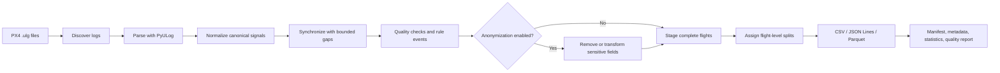

# PX4 Dataset Builder

[](https://github.com/LodeStonedrones/px4-dataset-builder/actions/workflows/ci.yml)
[](pyproject.toml)
[](LICENSE)
[](https://github.com/LodeStonedrones/px4-dataset-builder/releases)
[](docs/README.md)
[](https://docs.astral.sh/ruff/)

Build synchronized, documented, and privacy-aware datasets from one or more PX4 ULog (`.ulg`) flight logs.

> [!NOTE]
> **Project status: alpha.** The current release is validated with the deterministic synthetic ULog included in this repository. A public compatibility matrix based on authorized real-flight logs has not yet been completed.

[Quick start](#quick-start) · [Compatibility](#compatibility) · [Documentation](docs/README.md) · [Privacy](docs/privacy/PRIVACY.md) · [Contributing](CONTRIBUTING.md) · [Citation](docs/community/CITATION.md)

## Looking for test logs

> [!IMPORTANT]
> We are looking for **public, synthetic, or meaningfully anonymized PX4 ULogs** that can be legally redistributed or used for a clearly agreed compatibility investigation. Opening an issue starts a review; it is not permission to upload the log publicly.

Useful scenarios include GNSS degradation or loss, GPS-denied and indoor flights, urban canyons, tunnels, high vibration, aggressive maneuvers, multipath GNSS, EMI, RF interference affecting navigation or communications, and other difficult real-world environments.

We cannot accept classified, export-controlled, military, customer-confidential, accident-investigation, personally identifying, commercially sensitive, or operational logs that the contributor is not authorized to share. Do not attach a flight log, coordinates, identifiers, or sensitive metadata to a public issue or Discussion.

To contribute safely:

1. read the [log contribution and privacy guide](docs/community/CONTRIBUTOR_GUIDE.md#contributing-flight-data);
2. open a [Dataset Contribution request](https://github.com/LodeStonedrones/px4-dataset-builder/issues/new?template=dataset.yml) or use the proposed [Flight Logs Discussion category](docs/community/DISCUSSIONS.md#recommended-categories);
3. agree on one of the supported paths: synthetic reproduction, reviewed local inventory, or authorized fixture;
4. share a file only after maintainers confirm the scope, transfer method, retention, and redistribution terms.

The built-in policy can remove absolute GPS, derive local north/east coordinates and relative altitude, remove original timestamps, hash source filenames, remove vehicle identity metadata, and redact free-text log messages. These transformations reduce exposure but **do not guarantee anonymity**; review [Privacy and data governance](docs/privacy/PRIVACY.md) before sharing.

## Why this exists

ULogs are rich but heterogeneous: uORB fields change across PX4 releases, topics run at different frequencies, real fleets have missing data, and a naive row split leaks samples from the same flight into training and test. PX4 Dataset Builder provides a reproducible boundary between source logs and downstream analysis:

- canonical signal names and units mapped from documented uORB field candidates;
- gap-aware, signal-specific synchronization;
- explicit missing-data and quality findings;
- flight/group-level training, validation, and test splits;
- optional coordinate and metadata anonymization;
- CSV, JSON Lines, and compressed Parquet outputs;
- a manifest describing provenance, population, events, failures, and split distribution.

Processing is local. The application makes no network request and never uploads a log. It contains no proprietary navigation, anti-jamming, sensor-fusion, control, AI, or commercial decision logic. Event labels are ordinary configurable rules, not ground truth or flight-safety verdicts.

## Quick start

Python 3.12 or newer is required. There is no PyPI release yet. The shortest clean-install path is:

```bash
python3.12 -m venv .venv && source .venv/bin/activate
python -m pip install "git+https://github.com/LodeStonedrones/px4-dataset-builder.git"
px4-dataset generate-example && px4-dataset build synthetic-flight.ulg
```

The last command creates a deterministic, non-operational ULog and builds the first dataset in `./dataset`. Confirm its integrity and inspect its statistics:

```bash
px4-dataset validate dataset
px4-dataset stats dataset
```

<!-- Screenshot placeholder: docs/assets/cli-build.png — terminal showing generate-example,
build, validation, and statistics with no user-specific paths. See docs/assets/README.md. -->

For development from a clone:

```bash
git clone https://github.com/LodeStonedrones/px4-dataset-builder.git
cd px4-dataset-builder
python3.12 -m venv .venv
source .venv/bin/activate
python -m pip install -e '.[dev]'
make check
```

Build a directory recursively with four worker processes:

```bash
px4-dataset build ./logs --output ./dataset --format parquet --workers 4
```

Enable the configured anonymization policy:

```bash
px4-dataset init-config --output config.yaml
px4-dataset build ./logs --config config.yaml --anonymize
```

Review `config.yaml` before processing operational logs. The default thresholds are transparent examples and may not be appropriate for a particular vehicle or experiment.

## Pipeline



See the [architecture documentation](docs/architecture/ARCHITECTURE.md) for the architecture, dataset-generation, and single-flight processing diagrams.

## Compatibility

Status meanings:

- **Validated** — exercised by automated tests in this repository;
- **Experimental** — expected to work, but not covered by the complete CI/fixture matrix;
- **Planned** — roadmap work, not currently claimed as supported.

### PX4 versions and log sources

| PX4 version or source | Status | Current evidence |
|---|---|---|
| Project-generated synthetic ULog | **Validated** | Deterministic fixture parsed and built end-to-end in CI; this is not a real PX4-release claim |
| PX4 v1.14.x real-flight ULogs | **Planned** | Authorized compatibility fixtures requested for v0.2 |
| PX4 v1.15.x real-flight ULogs | **Planned** | Authorized compatibility fixtures requested for v0.2 |
| PX4 v1.16.x real-flight ULogs | **Planned** | Authorized compatibility fixtures requested for v0.2 |
| Other PX4 releases | **Experimental** | PyULog may parse them, but canonical field compatibility is not yet documented |

### Tested datasets

| Dataset class | Status | Scope |
|---|---|---|
| Included deterministic synthetic fixture | **Validated** | 1 synthetic flight, 11 source topics, 5 seconds, 51 normalized rows at the default 10 Hz |
| Authorized public real-flight fixtures | **Planned** | Versioned compatibility matrix with provenance sidecars |
| Multi-flight public research datasets | **Planned** | No public cohort has been benchmarked or certified yet |
| Private or operational datasets | **Experimental** | Local processing is available; suitability and privacy remain the operator's responsibility |

### Operating systems

| Environment | Status | Evidence |
|---|---|---|
| Linux, Python 3.12 and 3.13 | **Validated** | GitHub Actions unit, integration, type, package, and quality jobs |
| Linux container | **Validated** | Docker image is built in CI and runs as a non-root user |
| macOS | **Experimental** | Supported by the Python packaging model, but not part of CI |
| Windows | **Planned** | No automated Windows validation yet |

### Outputs

| Output | Status | Evidence |
|---|---|---|
| Parquet with Zstandard compression | **Validated** | Parametrized end-to-end integration test |
| CSV | **Validated** | Parametrized end-to-end integration test |
| JSON Lines | **Validated** | Parametrized end-to-end integration test |
| Manifest, metadata, events, statistics, and quality JSON | **Validated** | End-to-end build and dataset validation tests |
| ROS 2 bag / MCAP | **Not planned in core** | PyULog already provides `ulog2ros2bag`; document that maintained path instead of duplicating it |

The living measurement and evidence policy is in [Benchmarks and compatibility evidence](docs/benchmarks.md).

## Dataset layout

```text
dataset/
├── train/flights/             # complete flights assigned to training
├── validation/flights/        # complete flights assigned to validation
├── test/flights/              # complete flights assigned to test
├── flights/index.json         # flight → split/data/metadata mapping
├── events/events.parquet      # or .csv/.jsonl
├── metadata/
│   ├── <flight_id>.json
│   ├── signal_schema.json
│   └── effective_config.json
├── statistics/summary.json
├── data_quality_report.json
└── manifest.json
```

<!-- Screenshot placeholder: docs/assets/dataset-tree.png — generated directory tree only.
Additional placeholders for event and statistics output are specified in docs/assets/README.md. -->

Each flight table is wide and ordered by `time_s`. `timestamp_us` retains the original ULog clock unless anonymization is enabled. A signal appears only when a documented uORB candidate exists. Missing intervals remain null when a gap exceeds `max_interpolation_gap_s`.

The global manifest contains flight/sample counts, total duration, available sensor families, PX4 versions, event and split distributions, failed logs, quality summary, the effective configuration digest, and SHA-256/size evidence for every generated artifact. Builds are staged beside the destination and installed only after all outputs are complete.

## Canonical signals

The v0.1 catalog covers:

- GPS position, altitude, NED velocity, heading, fix type, satellite count, EPH, and EPV;
- local position and velocity;
- quaternion attitude plus derived roll, pitch, and yaw;
- accelerometer, gyro, magnetometer, and barometer;
- voltage, current, remaining fraction, discharged capacity, and battery warning;
- actuator outputs, navigation mode, arming state, failsafe, land state, and mission sequence;
- public estimator flags, reset counters, test ratios, and selected innovations;
- acceleration and gyro vibration metrics.

Mappings, units, sensitivity, valid ranges, and interpolation policies live in `topics/catalog.py` and are copied to `metadata/signal_schema.json`. Unknown or unavailable fields are not guessed.

## Event rules

The default YAML demonstrates `gps_lost`, `gps_degraded`, satellite/EPH/EPV checks, estimator reset/warning, vibration, battery levels, failsafe, takeoff, landing, mode change, and sensor gaps. Logged PX4 warning and error messages are extracted separately as timestamped events.

Four rule kinds are supported:

- `threshold`: contiguous interval satisfying a simple comparison;
- `change`: a finite state or counter value changes;
- `edge`: a comparison changes from false to true;
- `gap`: a null interval exceeds a duration.

Every rule-derived event records the rule name, signal, observed value, threshold, interval, severity, and description. Overlapping events remain visible. These are configurable observations, not automatically validated anomaly labels.

## Methodology and privacy

PX4 topics are asynchronous. The builder creates a regular flight-relative grid, 10 Hz by default. Continuous quantities use bounded linear interpolation; states use bounded previous-value semantics; and headings and quaternions use bounded nearest samples. Previous/nearest values may be carried beyond the final source observation only within the configured gap; the output grid never extends beyond the logged flight duration. Read [Resampling and methodology](docs/methodology/RESAMPLING.md) before publishing results.

All samples from one flight remain in exactly one split. Available strategies are seeded random flight assignment, stable flight hash, drone group, UTC date group, and complete event-signature stratification. Researchers must choose and audit the group representing their real generalization boundary.

Anonymization is opt-in because modifying evidence must be deliberate. It reduces exposure but cannot guarantee anonymity: motion patterns, timing, vehicle configuration, rare events, and hashes may still identify a flight. Read [Privacy and data governance](docs/privacy/PRIVACY.md) and obtain permission before sharing.

## Performance

Workers process independent logs and return one processed flight at a time to the coordinator, which stages completed tables. Multiprocessing therefore incurs DataFrame serialization and its scaling has not yet been benchmarked. Parquet uses Zstandard compression. No 100-log or 1,000-log public benchmark has been published. See [Benchmarks](docs/benchmarks.md) for the reproducibility protocol and empty results template.

Pandas is used because PyULog exposes NumPy arrays and Pandas provides mature time-series and export behavior. No alternative dataframe engine is planned unless published measurements identify a bottleneck that materially blocks adoption.

## Docker

```bash
docker build -t px4-dataset-builder .
docker run --rm \
  -v "$PWD/logs:/logs:ro" \
  -v "$PWD/dataset:/output" \
  px4-dataset-builder build /logs --output /output
```

The runtime is non-root and contains no cloud configuration.

## Documentation

| Topic | Document |
|---|---|
| Documentation map | [docs/README.md](docs/README.md) |
| Architecture and module boundaries | [docs/architecture/ARCHITECTURE.md](docs/architecture/ARCHITECTURE.md) |
| Quick-start tutorial | [docs/tutorials/QUICKSTART.md](docs/tutorials/QUICKSTART.md) |
| Privacy and data governance | [docs/privacy/PRIVACY.md](docs/privacy/PRIVACY.md) |
| Resampling methodology | [docs/methodology/RESAMPLING.md](docs/methodology/RESAMPLING.md) |
| Benchmarks and evidence | [docs/benchmarks.md](docs/benchmarks.md) |
| Project governance | [docs/community/GOVERNANCE.md](docs/community/GOVERNANCE.md) |
| Requirements and non-goals | [docs/REQUIREMENTS.md](docs/REQUIREMENTS.md) |
| Roadmap | [docs/ROADMAP.md](docs/ROADMAP.md) |

## Project status and ecosystem relationship

v0.1 is a working alpha validated by unit and end-to-end tests using a deterministic synthetic ULog. It does not claim a real-flight PX4 compatibility matrix. Development is adoption-first: release fixtures, measured evidence, and a safe contribution workflow take precedence over new formats or interfaces. ROS 2 bags, HDF5/Arrow IPC, web/desktop interfaces, hosted publishing, Flight Review duplication, ArduPilot/MAVLink parsing, cloud execution, and a dataset registry are outside the current core roadmap.

The parser is built on [PX4/PyULog](https://github.com/PX4/pyulog). This project focuses on local, synchronized dataset preparation, privacy controls, and flight-level dataset splits. It is complementary to [PX4 Flight Review v2](https://github.com/PX4/flight-review-rs), which provides log conversion, diagnostics, and interactive review.

PX4 Dataset Builder is an independent community project. It is not an official PX4 project and is not affiliated with or endorsed by PX4 or the Dronecode Foundation.

## Community

### Contributing

Start with [CONTRIBUTING.md](CONTRIBUTING.md) and the [contributor onboarding guide](docs/community/CONTRIBUTOR_GUIDE.md). Synthetic fixtures and authorized, privacy-reviewed compatibility fixtures are particularly valuable. The proposed Discussion structure is documented in [GitHub Discussions](docs/community/DISCUSSIONS.md).

### Contributor recognition

Code, documentation, review, reproducibility work, public methodology, and authorized fixture contributions all count. Recognition rules are documented in [Contributor Recognition](docs/community/RECOGNITION.md).

### Acknowledgements

The project depends on public PX4 formats and the work of the PyULog and broader Python open-source communities. See [Acknowledgements](docs/community/ACKNOWLEDGEMENTS.md). Acknowledgement does not imply endorsement.

### Research citations

No DOI has been issued. Until an immutable release archive exists, cite the exact version and commit used together with the repository URL. See [Research citation guidance](docs/community/CITATION.md) and [`CITATION.cff`](CITATION.cff).

### Community roadmap

Milestones describe exit criteria rather than promised dates. Compatibility evidence, privacy review, stable schemas, and contributor feedback take priority over feature count. See the [community strategy](docs/community/STRATEGY.md) and [roadmap](docs/ROADMAP.md).

Technical decisions and maintainer responsibilities are described in [Project Governance](docs/community/GOVERNANCE.md).

## License

This project is licensed under the [Apache License 2.0](LICENSE), a permissive open-source license with an explicit patent license covering applicable contributor patent claims.

The license covers this project. It does not grant rights to use PX4 or other third-party trademarks. PX4 is referenced solely to describe technical compatibility.
