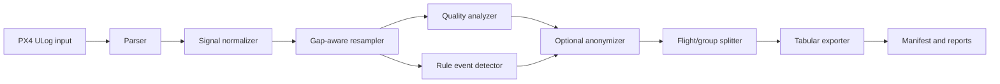
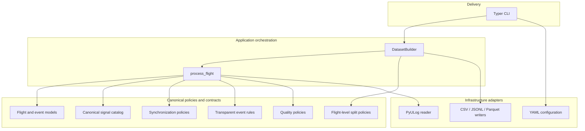
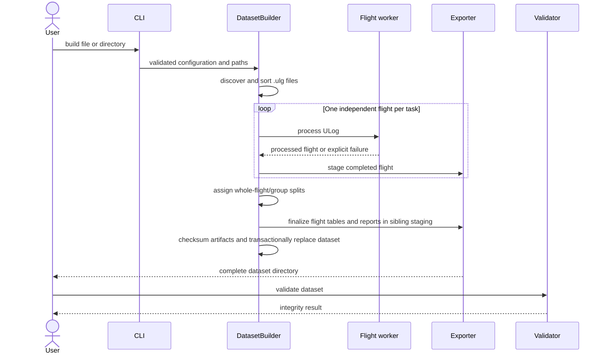
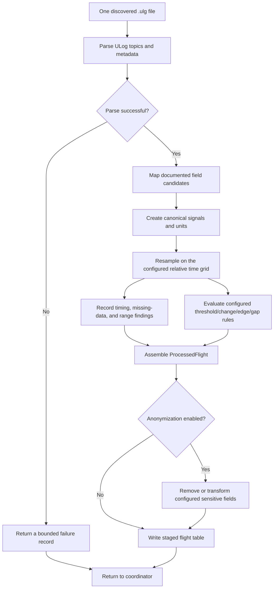

# Architecture

PX4 Dataset Builder uses pragmatic Clean Architecture boundaries without hiding the sequential nature of log processing. PX4-specific parsing and field mappings remain at the edges; canonical flight contracts and deterministic transformation policies remain central.

## Pipeline

## Architecture

Dependencies point toward canonical models and policies. Exporters do not know PX4 semantics, synchronization has no PyULog dependency, and event detection consumes canonical signals rather than raw uORB frames.

## Dataset generation flow

The validator is an explicit command after generation; the builder creates the manifest, effective configuration, and checksum evidence. A failed log is recorded while successfully processed flights remain usable. If every input fails, the build fails and an existing destination is preserved. With `--force`, the prior dataset is replaced only after the new sibling staging directory is complete.

## Flight processing

## Dependency rules

- `parser` owns PyULog-specific mechanics.
- `topics` owns reviewed PX4 field candidates, units, ranges, interpolation, and sensitivity.
- `signals` produces canonical names and derived public geometry.
- `synchronization` is a pure numerical policy with no PX4 dependency.
- `events` reads canonical tables and validated configuration only.
- `quality` observes raw timing and normalized values; it does not repair evidence.
- `anonymization` is the final transformation before durable flight data.
- `dataset` orchestrates work, preserves flight boundaries, and owns the manifest.
- `exporters` know storage formats but no PX4 semantics.
- `statistics` consumes metadata, events, and quality reports rather than full flight tables.

The flight is the aggregate boundary for parsing, quality, events, privacy, and split assignment. Worker count is bounded, and files are independent failure domains.

## Extension contracts

Any future reader would need to return `ParsedFlight`, and any future output would need an explicit consumer and fidelity contract. No new reader, output format, or plugin registry is currently planned; v0.1 deliberately keeps these extension points conceptual rather than adding maintenance surface.

ArduPilot and MAVLink require independent source catalogs rather than treating uORB fields as universal. Cloud processing is outside the core and cannot change local behavior.

## Security and integrity

Output paths derive from sanitized identifiers and fixed directories. Dataset validation resolves every manifest path, rejects references outside the dataset, checks metadata identity, and verifies SHA-256/size evidence in manifest schema 1.1. Existing non-empty outputs are refused unless the user explicitly supplies `--force`; replacement is transactional. ROS or cloud credentials do not exist in the core.
