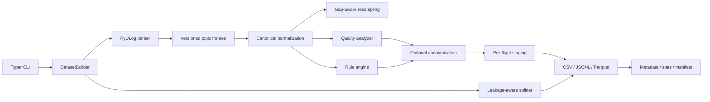
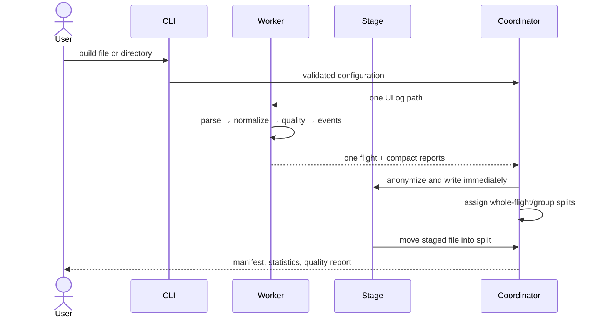

# Architecture

## Module diagram

## Dependency rules

- `parser` owns PyULog-specific mechanics.
- `topics` owns reviewed PX4 field candidates, units, ranges, interpolation, and sensitivity.
- `signals` produces canonical names and derived public geometry.
- `synchronization` is a pure numerical policy with no PX4 dependency.
- `events` reads canonical tables and validated configuration only.
- `quality` observes raw timing and normalized values; it does not repair evidence.
- `anonymization` is the last transformation before durable flight data.
- `dataset` orchestrates work, preserves flight boundaries, and owns the manifest.
- `exporters` know storage formats but no PX4 semantics.
- `statistics` consumes metadata/events/quality, not full flight tables.

This is a pragmatic Clean Architecture: the canonical contracts are central, format and UI dependencies remain at the edges, and each stage can be tested with in-memory inputs. The flight is the aggregate boundary for parsing, quality, events, privacy, and split assignment.

## Processing sequence

Worker count is bounded. Files are independent failure domains. A failed log becomes a manifest problem; it does not invalidate successfully generated flights.

## Extension contracts

Future readers should return `ParsedFlight`. Future output formats implement the tabular writer semantics and declare fidelity. ROS 2/HDF5/Arrow must preserve `time_s`, canonical names, nulls, and the signal schema. A future plugin registry should use entry points only after the schema reaches stability; v0.1 avoids a global mutable registry.

ArduPilot and MAVLink require their own catalogs rather than pretending uORB fields are universal. Cloud processing must remain a separate opt-in adapter and cannot change local behavior.

## Security and integrity

Output paths derive from sanitized identifiers and fixed directories. Dataset validation resolves each manifest path and rejects references outside the dataset. Existing non-empty outputs are refused unless the user explicitly supplies `--force`. ROS/cloud credentials do not exist in the core.
